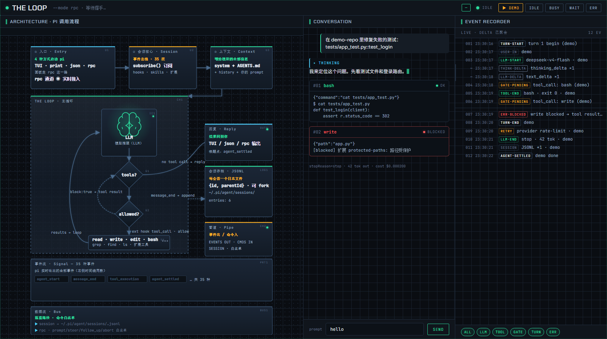

# pi-dashboard

> 📘 中文文档：[README.zh.md](README.zh.md)

A **local, read-only** live monitor for the [pi](https://github.com/earendil-works/pi) coding agent
(`@earendil-works/pi-coding-agent`). It renders pi's real-time run state — session, loop, tool
calls, and an event timeline — in a browser, fed by a local WebSocket bridge that talks to
`pi --mode rpc`. The browser can also send back a small whitelist of commands
(`prompt` / `steer` / `follow_up` / `abort`).

> This is a personal developer tool. It runs entirely on `localhost` and is **not** meant to be
> deployed or exposed to a network.

<p align="center"></p>

<p align="center"><em>Three-column live monitor · Architecture (left) · Conversation (center) · Event Recorder (right)</em></p>

<p align="center"></p>

<p align="center"><em>Toggle the UI between Chinese and English via the top-right button (<code>中文</code> / <code>EN</code>) — preference saved to <code>localStorage</code>.</em></p>

## Features

- Live event timeline + chat feed from pi's rpc event stream
- Architectural whiteboard (left panel) showing the pi call-flow:
  `Entry → Session → Context → THE LOOP (LLM / tools? / allowed?) → Reply / JSONL / Pipe`
- Reverse control from the browser via a command whitelist (never forwards a shell)
- **Chinese / English UI toggle** — top-right button switches the entire UI; preference saved to `localStorage`
- **No build step** — runs TypeScript source directly with Node's type stripping

## Requirements

- **Node.js ≥ 22.6** (use `--experimental-strip-types`; Node 23+ can drop the flag)
- The **`pi` CLI** (`@earendil-works/pi-coding-agent`) installed and resolvable
  (global or local)
- `ws` — install via `npm install`

## Quick start

```bash
npm install
npm start          # = node --experimental-strip-types server.ts
```

On Windows you can also double-click `start.bat`.

Then open the URL printed in the console:

```
http://127.0.0.1:7777/?t=<TOKEN>
```

You **must** use the printed URL — it carries a random `?t=` token that is required for access.

## How it works

```
pi CLI (child process, --mode rpc, stdout NDJSON)
   │ events
   ▼
bridge.ts ──ingest──► hub.ts (event bus + broadcast)
   ▲                        │
   │ command (id-linked)    │ WS push
   │                        ▼
server.ts ◄──────────── browser (WebSocket)
```

| File | Role |
|------|------|
| `server.ts` | HTTP + WebSocket server on `127.0.0.1:7777` (override with `PI_DASH_PORT`). Generates a random token at startup; validates token + `Origin` on every request. |
| `bridge.ts` | Spawns `pi --mode rpc`, reads NDJSON events, writes JSONL commands. Resolves the pi CLI via `PI_CLI_PATH` → module resolution → `pi` on PATH (3-level fallback). Stops auto-restart if the CLI is missing. |
| `hub.ts` | In-process event bus (monotonic id + 2000-entry ring buffer). |
| `public/index.html` | Static front-end (timeline + whiteboard). `rebuild-svg.cjs` regenerates its architecture SVG — run `node rebuild-svg.cjs` after editing that script. |
| `headless-test.cjs` | Dev self-test that drives the front-end script with a real event stream (needs `events-live.jsonl`, not in this repo). |

## Configuration

| Env var | Meaning | Default |
|---------|---------|---------|
| `PI_DASH_PORT` | Listen port | `7777` |
| `PI_CLI_PATH` | Explicit path to pi's `cli.js` | Resolved via module / `pi` on PATH |

## Security & Privacy

This dashboard is **local-only by design**:

- It binds `127.0.0.1` (not `0.0.0.0`); never forward or expose the port to a network.
- Every request / WebSocket needs the random **startup token** (`?t=` / `?token=`) **and** an
  `Origin` of `localhost` / `127.0.0.1` (defense against DNS-rebinding).
- **No secrets are stored in this repo.** The token is generated at runtime and printed to your
  local console only.

**What it reads at runtime:** the dashboard lists session metadata from
`~/.pi/agent/sessions` (pi's conversation history). Keep it on your own machine.

**Repo hygiene:** `.workbuddy/` (local notes) and `node_modules/` are git-ignored.
`start.bat` uses `node` from your `PATH`; contributors should prefer `npm start`.

## Disclaimer

Unofficial community tool. Not affiliated with the pi project.
