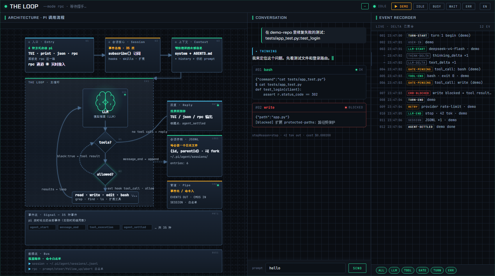
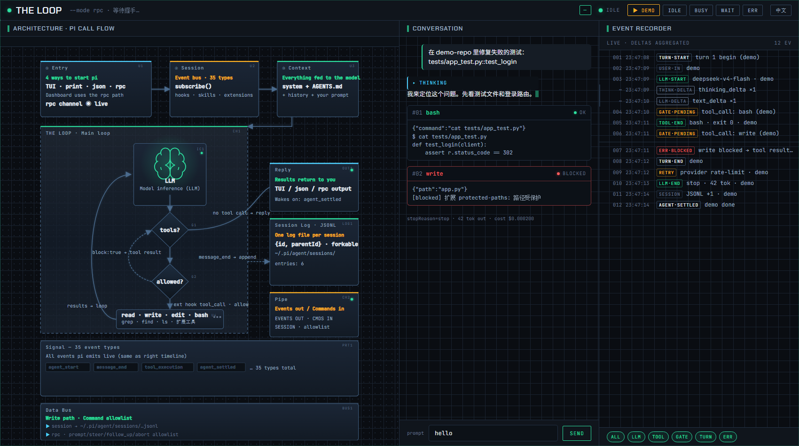

# pi-dashboard（中文）

> 📗 English documentation: [README.md](README.md)

一个**本地、只读**的实时监控面板，用于查看 [pi](https://github.com/earendil-works/pi) 编程智能体
（`@earendil-works/pi-coding-agent`）的运行状态。它通过本地 WebSocket 桥接 `pi --mode rpc`，
在浏览器中实时渲染 pi 的会话、主循环、工具调用和事件时间线；浏览器也可回传一小部分白名单命令
（`prompt` / `steer` / `follow_up` / `abort`）。

> 这是一个个人开发者工具。它完全运行在 `localhost` 上，**不应**被部署或暴露到网络中。

<p align="center"></p>

<p align="center"><em>三栏实时监控 · 架构（左）· 对话（中）· 事件记录器（右）</em></p>

<p align="center"></p>

<p align="center"><em>通过右上角按钮（<code>EN</code> / <code>中文</code>）一键切换中英文界面 · 偏好保存在 <code>localStorage</code></em></p>

## 功能特性

- 来自 pi rpc 事件流的实时时间线 + 对话流
- 左侧架构白板，展示 pi 的调用链路：
  `入口 → 会话 → 上下文 → 主循环（LLM / 工具？ / 允许？）→ 回复 / JSONL / 通道`
- 浏览器通过命令白名单反向控制（绝不转发 shell）
- **中/英文界面一键切换** —— 右上角按钮可随时切换整个 UI；偏好保存在 `localStorage`
- **无构建步骤** —— 借助 Node 的类型剥离直接运行 TypeScript 源码

## 环境要求

- **Node.js ≥ 22.6**（使用 `--experimental-strip-types`；Node 23+ 可省略该参数）
- 已安装且可解析的 **`pi` CLI**（`@earendil-works/pi-coding-agent`，全局或局部均可）
- `ws` —— 通过 `npm install` 安装

## 快速开始

```bash
npm install
npm start          # = node --experimental-strip-types server.ts
```

Windows 下也可以直接双击 `start.bat` 启动。

然后打开控制台打印的 URL：

```
http://127.0.0.1:7777/?t=<TOKEN>
```

你**必须**使用控制台打印出来的这个 URL —— 其中携带的随机 `?t=` token 是访问必需的凭证。

## 工作原理

```
pi CLI（子进程，--mode rpc，stdout 输出 NDJSON）
   │ 事件
   ▼
bridge.ts ──接入──► hub.ts（事件总线 + 广播）
   ▲                        │
   │ 命令（按 id 关联）      │ WebSocket 推送
   │                        ▼
server.ts ◄──────────── 浏览器（WebSocket）
```

| 文件 | 作用 |
|------|------|
| `server.ts` | 监听 `127.0.0.1:7777` 的 HTTP + WebSocket 服务（可用 `PI_DASH_PORT` 覆盖）。启动时生成随机 token；对每个请求校验 token 与 `Origin`。 |
| `bridge.ts` | 启动 `pi --mode rpc`，读取 NDJSON 事件、写入 JSONL 命令。解析 pi CLI 路径采用三级回退：`PI_CLI_PATH` → 模块解析 → PATH 中的 `pi`。CLI 缺失时停止自动重启。 |
| `hub.ts` | 进程内事件总线（单调 id + 2000 条环形缓冲）。 |
| `public/index.html` | 静态前端（时间线 + 白板）。`rebuild-svg.cjs` 负责重新生成其中的架构 SVG —— 修改该脚本后运行 `node rebuild-svg.cjs`。 |
| `headless-test.cjs` | 开发自测脚本，用真实事件流驱动前端（依赖仓库外的 `events-live.jsonl`）。 |

## 配置项

| 环境变量 | 含义 | 默认值 |
|---------|---------|---------|
| `PI_DASH_PORT` | 监听端口 | `7777` |
| `PI_CLI_PATH` | pi 的 `cli.js` 显式路径 | 经模块解析 / PATH 中的 `pi` 推断 |

## 安全与隐私

本面板**从设计上仅限本地使用**：

- 绑定 `127.0.0.1`（而非 `0.0.0.0`）；切勿将端口转发或暴露到网络。
- 每个请求 / WebSocket 都需携带随机的**启动 token**（`?t=` / `?token=`）**且** `Origin` 为
  `localhost` / `127.0.0.1`（防御 DNS rebinding 攻击）。
- **本仓库不存储任何密钥。** token 仅在运行时生成并打印到你的本地控制台。

**运行时读取内容：** 面板会从 `~/.pi/agent/sessions`（pi 的会话历史）读取会话元数据。请保留在你自己的机器上。

**仓库卫生：** `.workbuddy/`（本地笔记）与 `node_modules/` 已被 git 忽略。
`start.bat` 使用 `PATH` 中的 `node`；贡献者建议优先使用 `npm start`。

## 免责声明

非官方社区工具，与 pi 项目无隶属关系。
